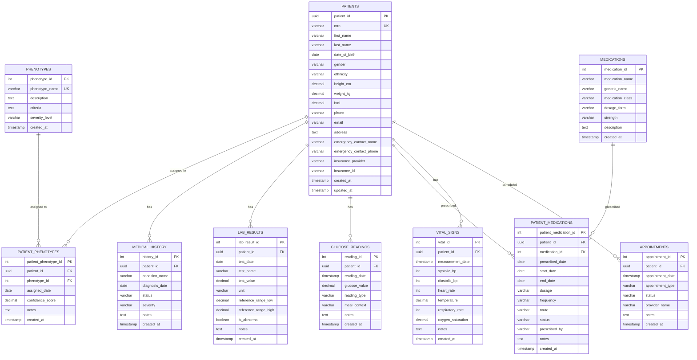

# Diabetes Management System Database

A comprehensive PostgreSQL database schema for diabetes management with support for 5 key phenotypes and synthetic patient data generation.

## Overview

This project provides a complete database solution for diabetes management, including:

- **Comprehensive Schema**: 10+ tables covering patient demographics, medical records, lab results, medications, and more
- **5 Key Phenotypes**: Type 1, Type 2, Gestational Diabetes, MODY, and LADA
- **Synthetic Data**: 20 realistic patient profiles with phenotype-specific characteristics
- **Performance Optimized**: Indexes and views for efficient querying

## Database Schema

### Entity-Relationship (ER) Diagram



### Core Tables

1. **patients** - Patient demographics and contact information
2. **phenotypes** - Diabetes phenotype definitions and criteria
3. **patient_phenotypes** - Patient-phenotype assignments with confidence scores
4. **medical_history** - Patient medical conditions and diagnoses
5. **lab_results** - Laboratory test results and reference ranges
6. **glucose_readings** - Blood glucose monitoring data
7. **medications** - Medication catalog
8. **patient_medications** - Patient medication prescriptions
9. **vital_signs** - Patient vital signs measurements
10. **appointments** - Patient appointment scheduling

### Key Features

- **UUID Primary Keys** for patient identification
- **Referential Integrity** with foreign key constraints
- **Data Validation** with CHECK constraints
- **Audit Trails** with created_at/updated_at timestamps
- **Performance Indexes** on frequently queried columns
- **Summary Views** for quick patient overviews

## 5 Diabetes Phenotypes

### 1. Type 1 Diabetes - Autoimmune
- **Characteristics**: Autoimmune destruction of pancreatic beta cells
- **Age Range**: 15-40 years
- **BMI**: Typically lean (18-25)
- **Treatment**: Insulin therapy required
- **Lab Markers**: Low C-peptide, positive autoantibodies

### 2. Type 2 Diabetes - Insulin Resistant
- **Characteristics**: Insulin resistance with relative deficiency
- **Age Range**: 40-70 years
- **BMI**: Often overweight/obese (25-40)
- **Treatment**: Oral medications + lifestyle modification
- **Lab Markers**: Elevated C-peptide, insulin resistance

### 3. Gestational Diabetes
- **Characteristics**: Diabetes diagnosed during pregnancy
- **Age Range**: 25-45 years (pregnant females)
- **BMI**: Variable, often normal to overweight
- **Treatment**: Diet, exercise, sometimes insulin
- **Lab Markers**: Elevated OGTT, usually resolves postpartum

### 4. MODY (Maturity Onset Diabetes of the Young)
- **Characteristics**: Monogenic form with autosomal dominant inheritance
- **Age Range**: 25-45 years
- **BMI**: Typically normal weight
- **Treatment**: Sulfonylureas often effective
- **Lab Markers**: C-peptide present, family history

### 5. LADA (Latent Autoimmune Diabetes in Adults)
- **Characteristics**: Slowly progressive autoimmune diabetes
- **Age Range**: 30-60 years
- **BMI**: Often normal weight
- **Treatment**: Gradual progression to insulin
- **Lab Markers**: Positive autoantibodies, gradual progression

## Setup Instructions

### Prerequisites

- PostgreSQL 12+ installed and running
- Python 3.8+ with pip
- Access to create databases and tables

### Installation

1. **Clone or download the project files**

2. **Install Python dependencies**:
   ```bash
   pip install -r requirements.txt
   ```

3. **Configure database connection**:
   ```bash
   cp env_example.txt .env
   # Edit .env with your database credentials
   ```

4. **Create database and apply schema**:
   ```bash
   python setup_database.py
   ```

5. **Populate with synthetic data**:
   ```bash
   python populate_database.py
   ```

### Database Configuration

The default configuration assumes:
- **Host**: localhost
- **Database**: diabetes_db
- **User**: postgres
- **Password**: password
- **Port**: 5432

Modify the `.env` file or environment variables to match your setup.

## Data Population

The `populate_database.py` script creates:

- **5 phenotypes** with detailed descriptions and criteria
- **20 patients** (4 per phenotype) with realistic demographics
- **Medical history** entries specific to each phenotype
- **Lab results** with phenotype-appropriate values
- **Glucose readings** for the past 30 days
- **Vital signs** measurements
- **Medication prescriptions** tailored to each phenotype

### Sample Data Characteristics

Each phenotype has distinct characteristics:

- **Age distributions** appropriate for the condition
- **BMI ranges** reflecting typical patient profiles
- **Lab values** within realistic ranges for each phenotype
- **Medication patterns** matching standard treatment protocols
- **Glucose patterns** reflecting typical glycemic control

## Query Examples

### Patient Summary by Phenotype
```sql
SELECT 
    ph.phenotype_name,
    COUNT(p.patient_id) as patient_count,
    AVG(p.bmi) as avg_bmi,
    AVG(p.age) as avg_age
FROM patients p
JOIN patient_phenotypes pp ON p.patient_id = pp.patient_id
JOIN phenotypes ph ON pp.phenotype_id = ph.phenotype_id
GROUP BY ph.phenotype_name;
```

### Recent Glucose Readings
```sql
SELECT 
    p.first_name,
    p.last_name,
    gr.glucose_value,
    gr.reading_type,
    gr.reading_date
FROM patients p
JOIN glucose_readings gr ON p.patient_id = gr.patient_id
WHERE gr.reading_date >= CURRENT_DATE - INTERVAL '7 days'
ORDER BY gr.reading_date DESC;
```

### Abnormal Lab Results
```sql
SELECT 
    p.first_name,
    p.last_name,
    lr.test_name,
    lr.test_value,
    lr.unit,
    lr.reference_range_low,
    lr.reference_range_high
FROM patients p
JOIN lab_results lr ON p.patient_id = lr.patient_id
WHERE lr.is_abnormal = true
ORDER BY lr.test_date DESC;
```

## File Structure

```
diabets/
├── schema.sql              # Database schema definition
├── populate_database.py    # Data population script
├── setup_database.py       # Database setup script
├── clean_database.py       # Database cleanup script
├── requirements.txt        # Python dependencies
├── env_example.txt         # Environment configuration example
├── sample_queries.sql      # Example SQL queries
└── README.md              # This file
```

## Contributing

This database schema is designed to be extensible. Consider adding:

- Additional phenotype classifications
- More detailed medication tracking
- Comorbidity management
- Treatment outcome tracking
- Patient education and compliance data

## License

This project is provided as-is for educational and research purposes. Please ensure compliance with relevant healthcare data regulations when using in production environments. 